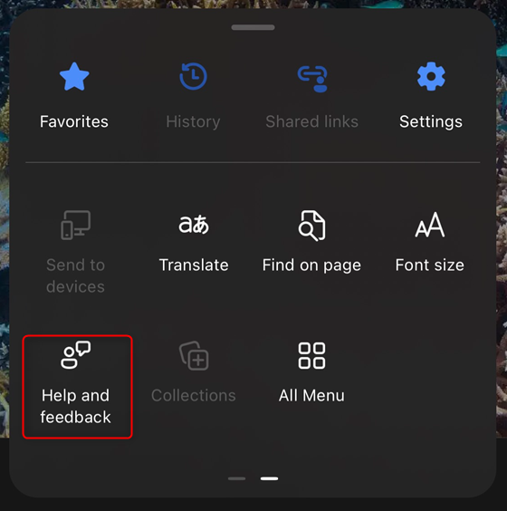

# Collect offline Diagnostic Data on Edge on iOS

1. Open **Edge**, access **edge://flags** and enable **Microsoft Edge for Business debug mode**. After that, exit and reopen Edge. 
    

1. **reproduce issue**  
    1. **Normal Mode**, click the user profile on the left up cornor and click **Help and feedback**. 
     
    1. **In Private Mode**, click the menu on the right bottom cornor and click **Help and feedback**. 
     
    Click **Help and feedback** in the right tab  
    

1. Ensure all options are turned on and click **Share** button. 
    

1. Save it to local. 
    
