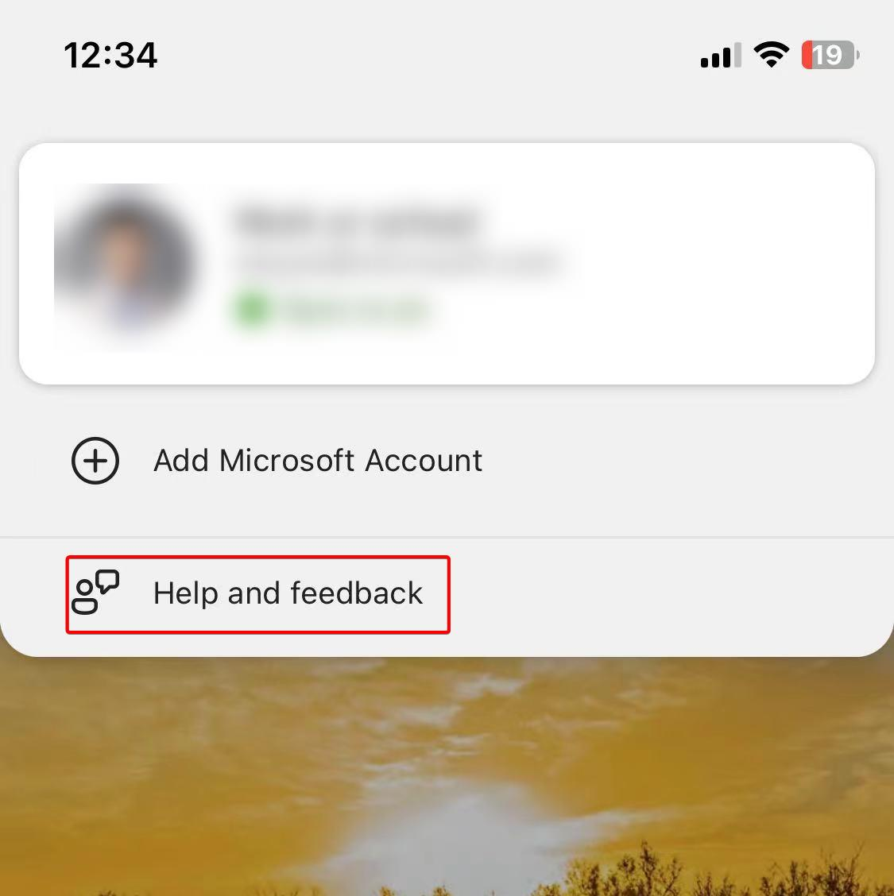
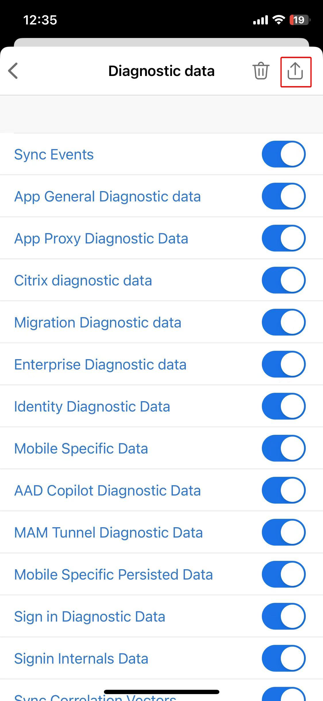
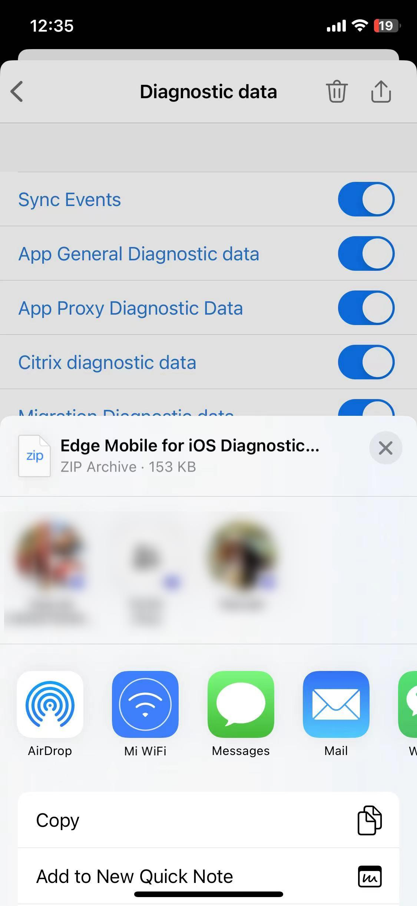

# Collect offline Diagnostic Data on Edge on iOS

1. Open **Edge**, access **edge://flags** and enable **Microsoft Edge for Business debug mode**. After that, reopen Edge. 
    

1. **reproduce issue**, click the account logo on the left cornor and **click Help and feedback**. 
    

1. Ensure all options are turned on and click **Share** button. 
    

1. Save it to local. 
    
