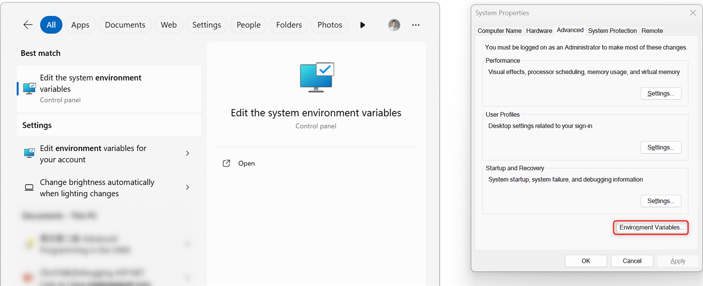
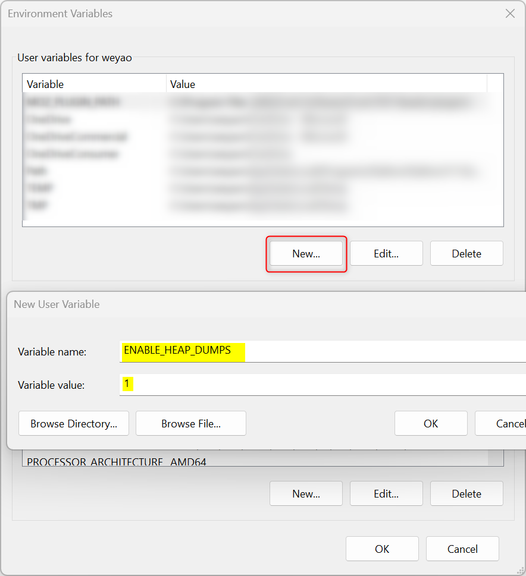
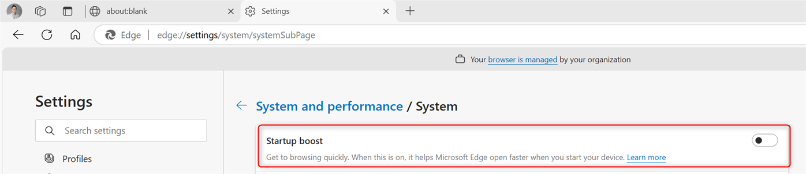

# How to capture Full User crash dump on Edge
1. Search and open **Environment Variables**.  
    

1. Add a **New User Variable**,  
`Variable name: ENABLE_HEAP_DUMPS` 
`Variable value: 1` 
    

1. Access `edge://settings/system` and **disable Startup boost** 
    
     Tips: if this setting is greyed out and not allowed to change, please using command or powershell with Admin to run below cmdlet,
     `REG ADD "HKLM\SOFTWARE\Policies\Microsoft\Edge" /v StartupBoostEnabled /t REG_DWORD /d 0 /f` 

1. Restart Edge compeletely and take settings effect. Please using taskmgr and ensure **all msedge.exe are closed**. 

1. Open Edge and **reproduce issue**. Then, check if there is any dump files generated at `%LOCALAPPDATA%\Microsoft\Edge\User Data\Crashpad\reports`. 