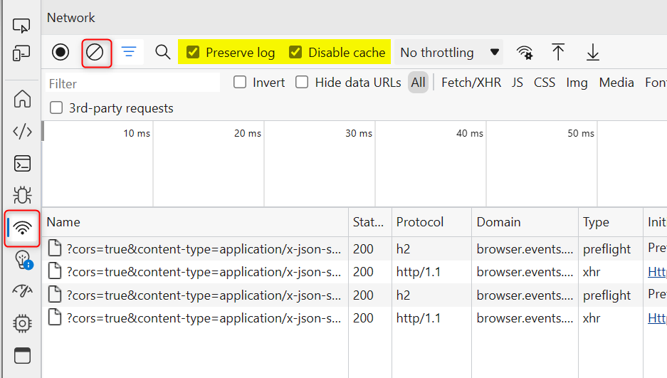
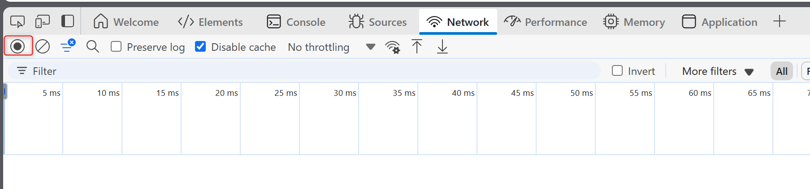
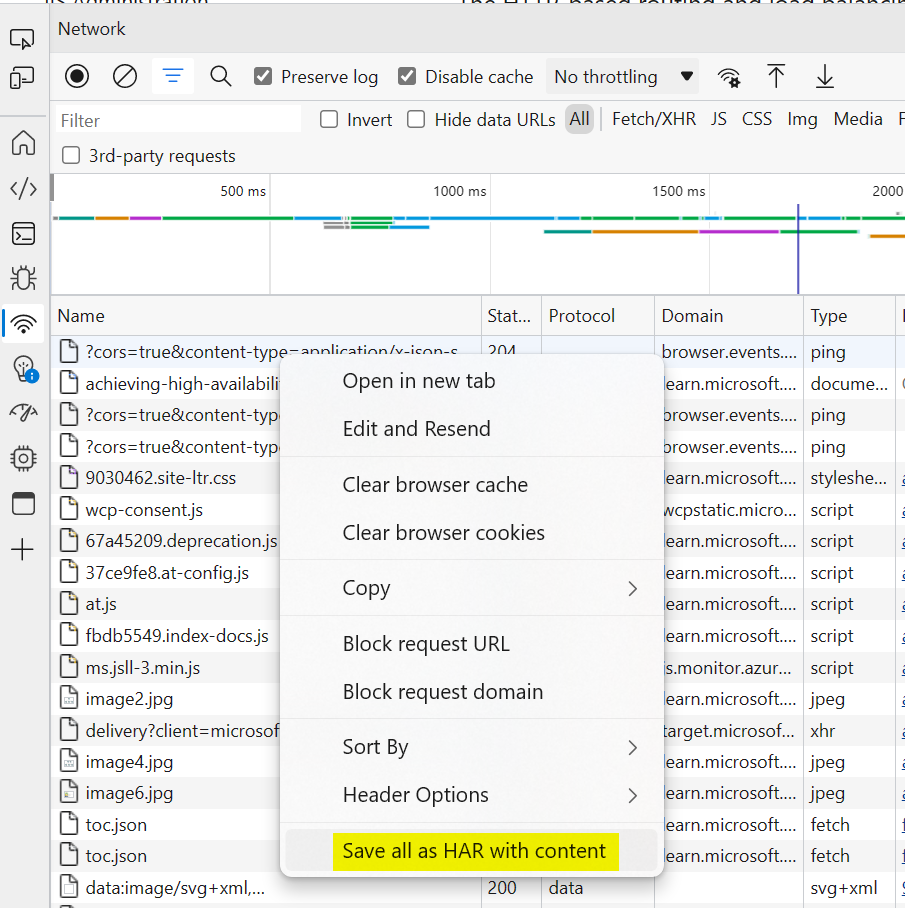

# How to Collect Network Trace Log from Edge
1. Open **Edge** and launch  **DevTools** by press **F12**. 

1. Go to the **Network** tab, click on **clear cache** and check the **Disable Cache** option. 
    

1. Click the **Record** button to begin recording, then reproduce issue. 
    

1. Once the issue is reproduced and the request is complete, click the **Record** button to stop recording. Then, click the **Export HAR** button to save it. 
    

For more details, please refer to the [guidance](https://learn.microsoft.com/en-us/azure/azure-portal/capture-browser-trace#microsoft-edge) in the Edge documentation.