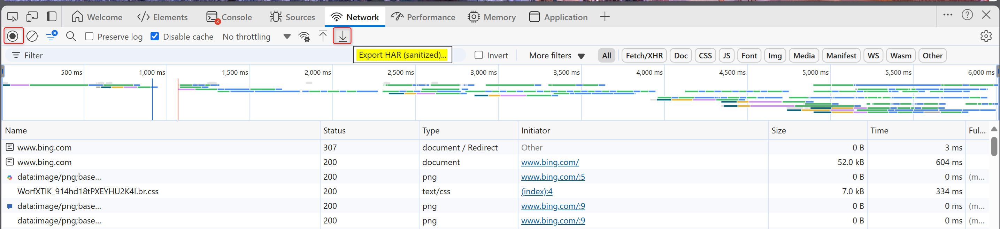

# Collect network trace log from Edge
1. Launch **Edge** and open **DevTools** by press **F12**. 

1. Choose **Network** icon, click **clear cache** and select **Preserve log** and **Disable Cache**. 
    

1. Click **Record** and reproduce issue 
    

1. Right click and select **Save all as HAR with content** 
    

The [guidance](https://learn.microsoft.com/en-us/azure/azure-portal/capture-browser-trace#microsoft-edge) at Edge document