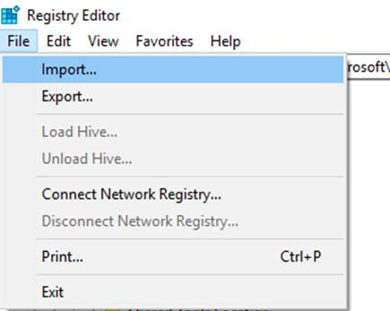
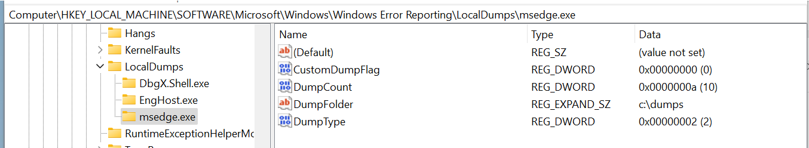

# Collect Edge crash dump by WER
1. Create target folder, **C:\dumps**.  

1. Download [msedge-wer.reg](Browsers\Scripts\msedge-wer.reg) and **import** it to Registry.  
    

1. Double check if it's imported successuly as below screen.  
`HKLM\SOFTWARE\Microsoft\Windows\Windows Error Reporting\LocalDumps\msedge.exe`  
    

1. Once issue happens again, check if any dump files generated in the **C:\dumps**.