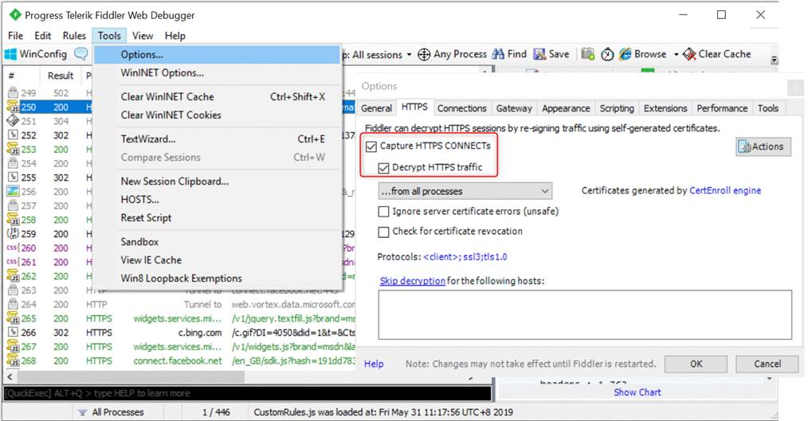
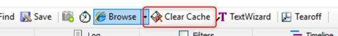
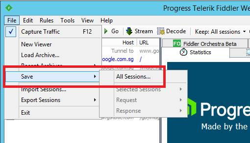
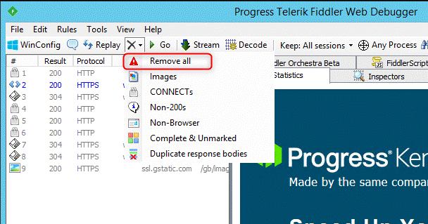

# Collect Fiddler trace for Browsers

1. [Download](https://www.telerik.com/download/fiddler) and [Install](https://docs.telerik.com/fiddler/Configure-Fiddler/Tasks/InstallFiddler) Fiddler

1. Launch **Fiddler**. 
    

1. Enable **decrypt HTTPS traffic**, it will prompt to install certificate. Please click ok. 
    

1. **Clear Cache** 
    

1. Open browser and **reproduce issue**. 
    

1. **Save Captrue** 
    

1. **Clean session cache** and capture again for **good scenario**. 
    