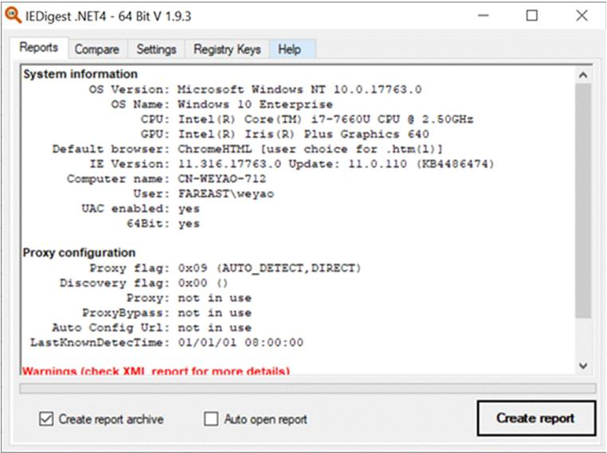
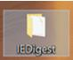

# Collecting and comparing Internet Explorer settings

1. Download and Run [IEDigest](https://aka.ms/IEDigest) 

1. Click **Create Report**  
    

1. It will save to "IEDigest" folder on desktop. Find and zip it. 
    
