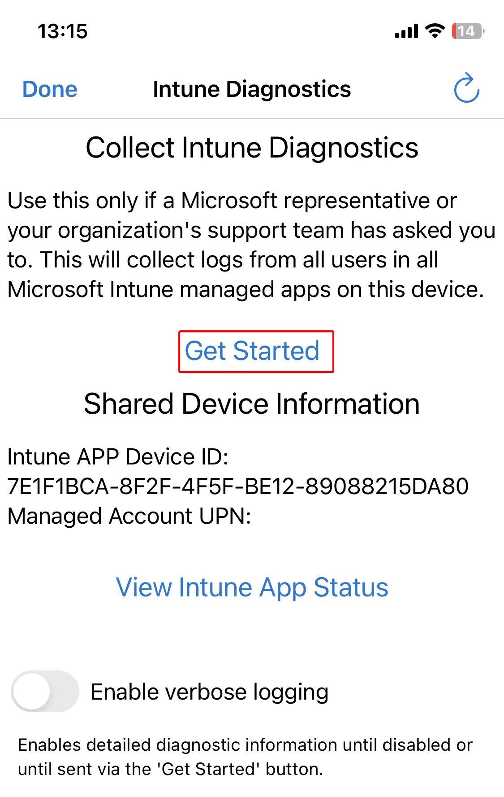
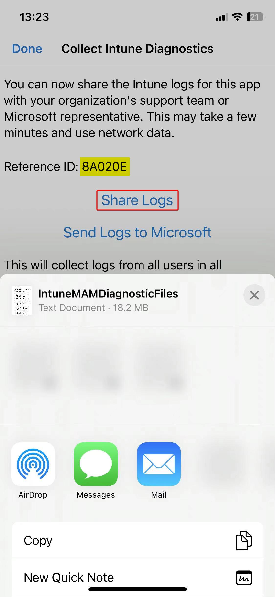

# Collect Intune Help Data on Edge on iOS

1. Open **Edge** -> **Reproduce issue** -> access **edge://intunehelp** -> click on **Get Started**. 
    

1. Get **Reference ID**, click on **Share Logs** and save it to local. 
    
