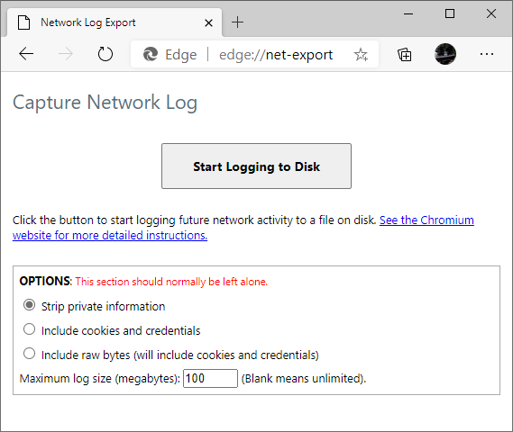

# Capturing Network traffics logs on Chromium browsers

1. Access **about://net-export**. *Optional but helpful: Close all browser tabs but one*. 

1. Click on **Start Logging to Disk**. 

1. Choose a filename and to save the traffic to.  *Tip: Pick a location you can easily find later, like your Desktop*

1. Reproduce the networking problem in a **new tab**.  *If you close or navigate the //net-export tab, the logging will stop automatically.*

1. After reproducing the problem, press the **Stop Logging button**.

1. *Optional:* If the resulting file is very large, you can compress it to a ZIP file.

Reference: https://textslashplain.com/2020/01/17/capture-network-logs-from-edge-and-chrome/