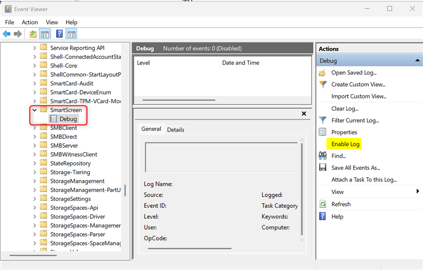
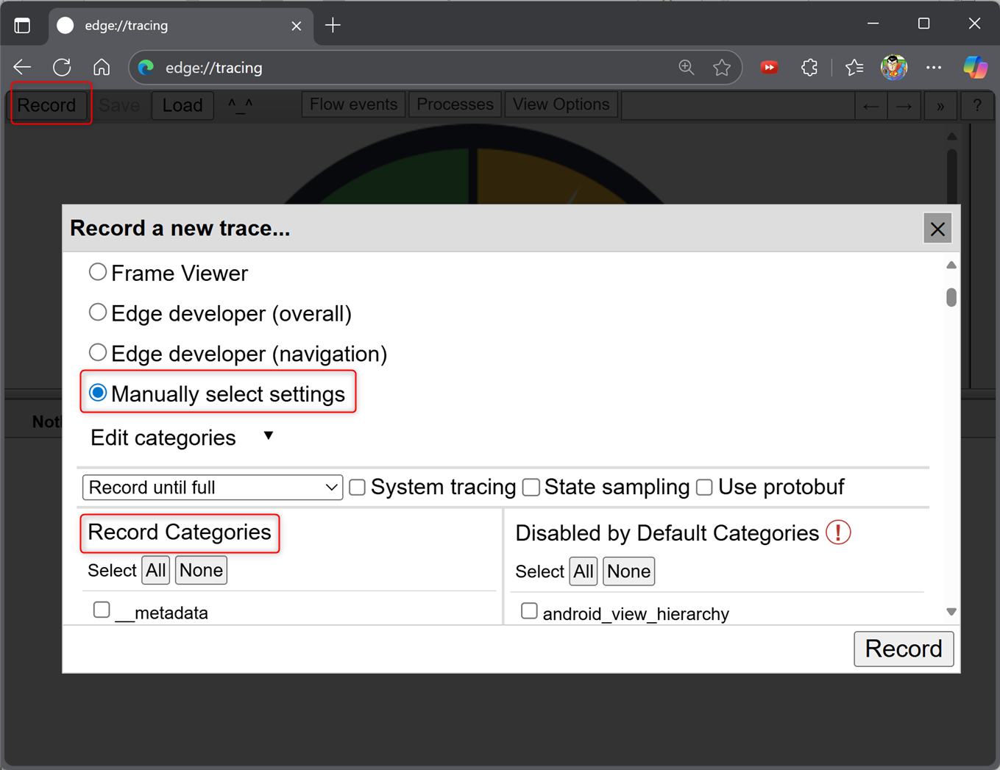
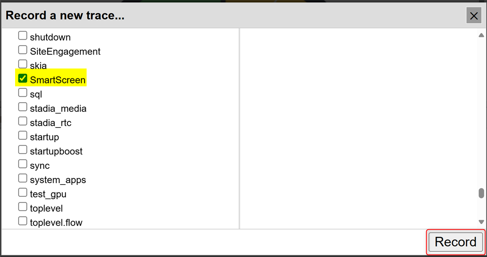
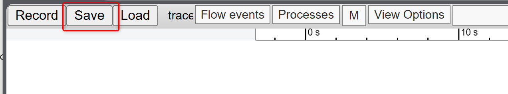
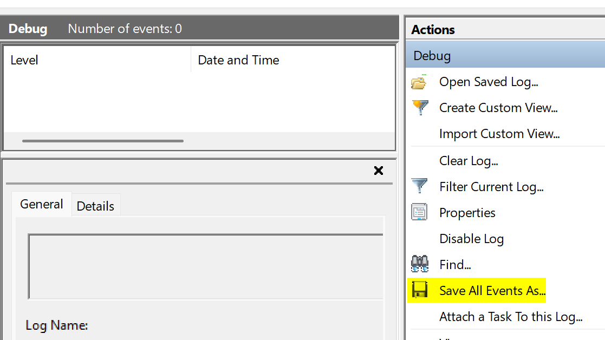
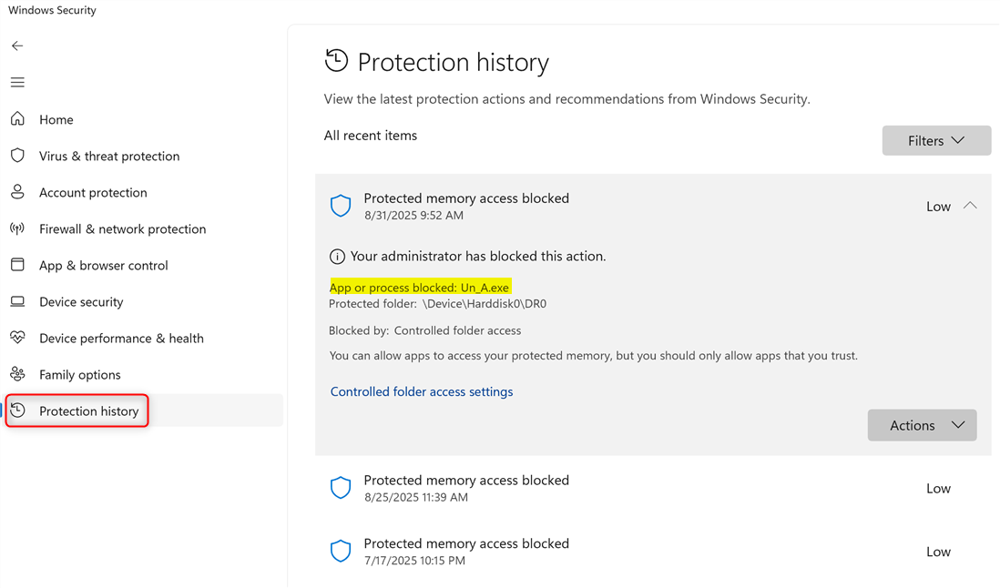

# Checklist of SmartScreen for Edge

1. Enable **SmartScreen Debug log**
    - Open Event viewer and access *Applications and services Logs → Microsoft → Windows → SmartScreen → Debug*. 
    - Click **Enable Log**.
     

2. Enable **edge tracing log**
    - Open Edge and access *edge://tracing* in address bar. 
    - Click *Reload*, choose *Manually select settings*. 
     
    - Check *SmartScreen* only and remove others in the *Record Categories*. Click **Record**
     

3. > Reproduce issue after completes *#1* and *#2*.

4. *Stop* and *Save* edge tracing.
     

5. Check *SmartScreen Debug log* and click *Save All Events As* if any items generated.
     

6. Access *Windows Security → Protection History*, expend and check items about blocked content. Take screenshots about SmartScreen related items.
     