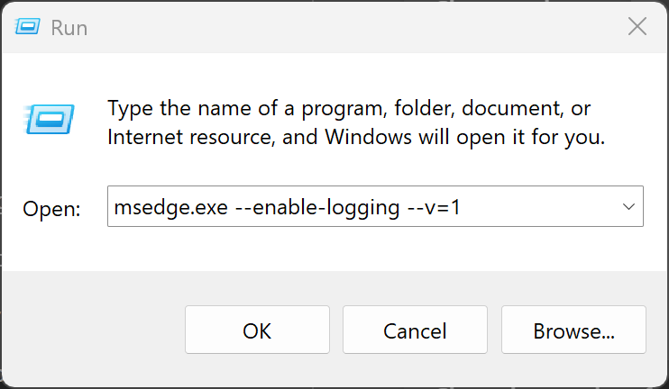

# Collect Chrome_debug.log

1. Completedly exits Edge, open it again by **Run** with `msedge.exe --enable-logging --v=1`. 

1. Reproduce issue

1. Collect log file from `%LOCALAPPDATA%\Microsoft\Edge\User Data\chrome_debug.log`.

Reference: https://support.google.com/chrome/a/answer/6271282?hl=en#zippy=%2Cwindows