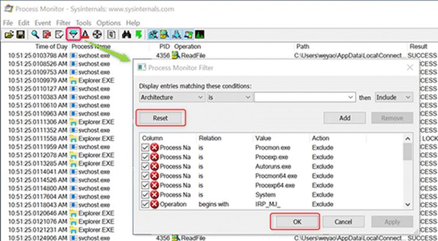
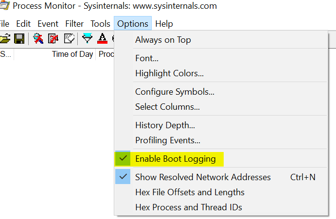
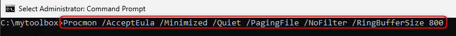
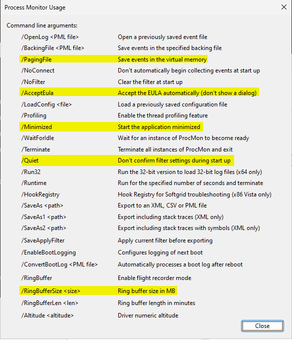
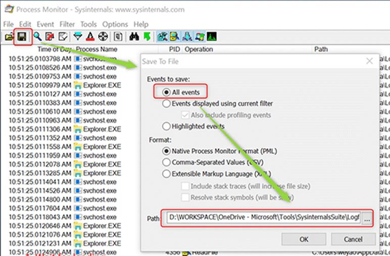

# Capture procmon

1. Download [Procmon](https://docs.microsoft.com/zh-cn/sysinternals/downloads/procmon).  

1. Launch **procmon.exe** as adminstator and reset filter.  

    - Optional, Enable Boot Logging if a server reboot is needed to reproduce the issue.  

1. Optionally, if setting a log size limit, launch Command Prompt with admin privileges, navigate to the Procmon folder, and run the following command. You can change the RingBufferSize up to 4GB.  
`Procmon /AcceptEula /Minimized /Quiet /PagingFile /RingBufferSize 800` 

  *Procmon Usage*  

1. **Reproduce** your issue.  

1. Save "Logfile.PML" to local disk.  
